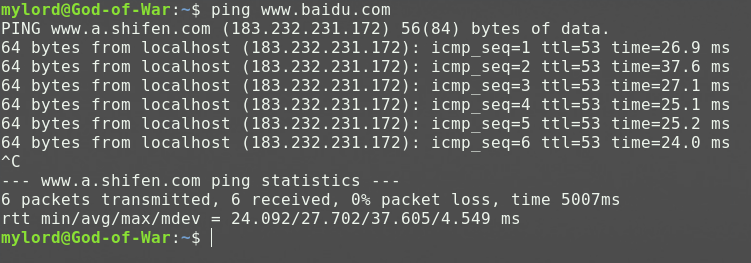
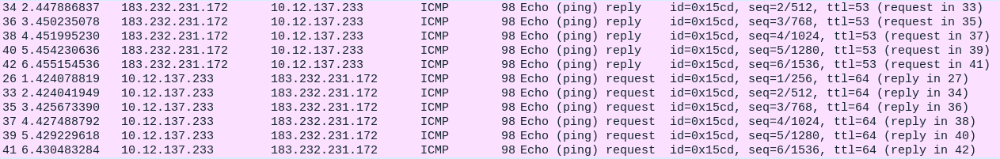
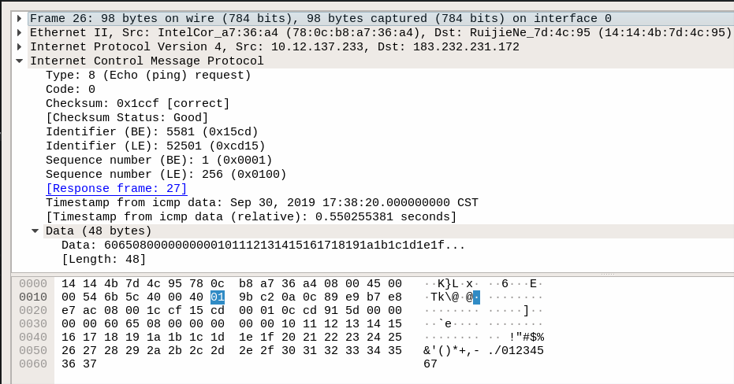
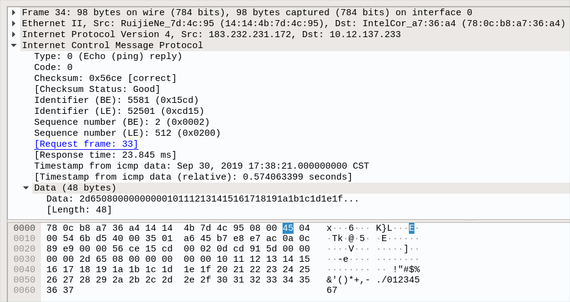
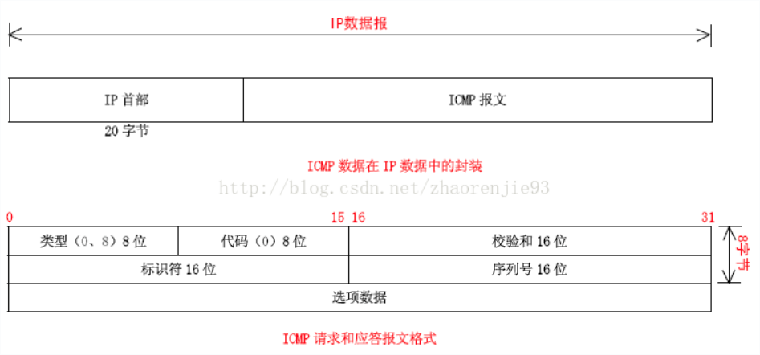

# 在Linux上用C++实现ping功能
> 首先我们在terminal上使用ping命令并用wireshark软件抓包，看看实现ping命令需要那些协议，以及ping的数据包由那些内容构成。





> 用wireshark抓包后,发现ping命令发送的请求报文和收到的应答报文都是ICMP(Internet Control Message Protocol)网际控制报文协议。我们再仔细解析请求报文和应答报文：

 



> 发现ICMP报文是装在IP数据报中的，并且ICMP报文具有以下字段：Type（8位）、Code（8位）、Cheksum（16位）、Identifier（16位）、Sequence（16位）、Timestamp（8位）、Data。
> 结合以上对ping命令的分析，我们可以想到，实现ping命令，需要用到ICMP协议的相关内容。想要实现对IMCP报文自定义构建，我们还需要用到SOCK_RAW原始套接字的相关内容。在Linux上申请原始套接字需要root权限，但是ping命令可以被普通用户正常运行，因此我们还需要用到在Linux上以普通用户运行特权指令的相关内容（在Linux上以普通用户运行特权指令在我的[上一篇博客](https://tomylord.github.io/2019/09/25/%E6%B5%85%E8%B0%88Linux%E4%B8%8B%E7%9A%84ruid%E3%80%81euid%E3%80%81suid%E5%8F%8A%E6%99%AE%E9%80%9A%E7%94%A8%E6%88%B7%E5%8F%AF%E6%89%A7%E8%A1%8C%E7%A8%8B%E5%BA%8F%E4%BB%A5root%E6%9D%83%E9%99%90%E7%89%B9%E6%9D%83%E8%BF%90%E8%A1%8C%E7%9A%84%E6%96%B9%E6%B3%95/)有详细的说明，本文不在赘述）。此外，我们可以观察到ping命令是通过捕获Ctrl+C指令后才结束的，但是在结束之前，还对整个发送接收情况做了总结，因此，实现Ping命令还需要用到Linux上的信号机制。
## ICMP报文
IMCP协议用于在IP主机、路由器之间传递控制消息，允许主机或路由器报告差错情况和提供有关异常情况的报告。ICMP协议不是高层协议（看起来好像是高层协议，因为ICMP报文是装在IP数据报中，作为其中的数据部分），而是IP层的协议。ICMP报文作为IP层数据报的数据，加上数据报的首部，组成IP数据报发送出去。ICMP报文格式如下图所示：



在谢希仁编著的第7版计算机网络教材中，ICMP报文的格式与上图相同，但是从上文的抓包情况来看，真正的ICMP报文在16位序列号数据之后，Data数据之前还加入了8位的时间戳数据。
仔细对比上文对请求报文和应答报文的抓包数据，发现除了ICMP报文的序列号(seq)因包而异以外，Type字段也不相同。查阅文献后知道ICMP报文类型是根据Type字段和Code字段的组合来确定的。`Type = 0，Code = 0`代表回送请求(Echo Request)，`Type = 8，Code = 0`代表回送应答(Echo Reply)，分别对应ping命令的请求报文和应答报文。
对于ICMP报文的校验和(Checksum)字段的计算，只需要以下几个步骤:
+ 将校验和字段置零。
+ 将每两个字节（16位）相加（二进制求和）直到最后得出结果，若出现最后还剩一个字节继续与前面结果相加。
+ (溢出)将高16位与低16位相加，直到高16位为0为止。
+ 将最后的结果（二进制）取反。
用C/C++对ICMP报文数据的构造，可以直接利用`ip_icmp.h`头文件中有关ICMP报文的内容进行构造。`struct icmp`结构如下：
```
struct icmp
{
  uint8_t  icmp_type;	/* type of message, see below */
  uint8_t  icmp_code;	/* type sub code */
  uint16_t icmp_cksum;	/* ones complement checksum of struct */
  union
  {
    unsigned char ih_pptr;	/* ICMP_PARAMPROB */
    struct in_addr ih_gwaddr;	/* gateway address */
    struct ih_idseq		/* echo datagram */
    {
      uint16_t icd_id;
      uint16_t icd_seq;
    } ih_idseq;
    uint32_t ih_void;

    /* ICMP_UNREACH_NEEDFRAG -- Path MTU Discovery (RFC1191) */
    struct ih_pmtu
    {
      uint16_t ipm_void;
      uint16_t ipm_nextmtu;
    } ih_pmtu;

    struct ih_rtradv
    {
      uint8_t irt_num_addrs;
      uint8_t irt_wpa;
      uint16_t irt_lifetime;
    } ih_rtradv;
  } icmp_hun;
#define	icmp_pptr	icmp_hun.ih_pptr
#define	icmp_gwaddr	icmp_hun.ih_gwaddr
#define	icmp_id		icmp_hun.ih_idseq.icd_id
#define	icmp_seq	icmp_hun.ih_idseq.icd_seq
#define	icmp_void	icmp_hun.ih_void
#define	icmp_pmvoid	icmp_hun.ih_pmtu.ipm_void
#define	icmp_nextmtu	icmp_hun.ih_pmtu.ipm_nextmtu
#define	icmp_num_addrs	icmp_hun.ih_rtradv.irt_num_addrs
#define	icmp_wpa	icmp_hun.ih_rtradv.irt_wpa
#define	icmp_lifetime	icmp_hun.ih_rtradv.irt_lifetime
  union
  {
    struct
    {
      uint32_t its_otime;
      uint32_t its_rtime;
      uint32_t its_ttime;
    } id_ts;
    struct
    {
      struct ip idi_ip;
      /* options and then 64 bits of data */
    } id_ip;
    struct icmp_ra_addr id_radv;
    uint32_t   id_mask;
    uint8_t    id_data[1];
  } icmp_dun;
#define	icmp_otime	icmp_dun.id_ts.its_otime
#define	icmp_rtime	icmp_dun.id_ts.its_rtime
#define	icmp_ttime	icmp_dun.id_ts.its_ttime
#define	icmp_ip		icmp_dun.id_ip.idi_ip
#define	icmp_radv	icmp_dun.id_radv
#define	icmp_mask	icmp_dun.id_mask
#define	icmp_data	icmp_dun.id_data
};
```
上述结构体中我们只需要关注icmp_type、icmp_code、icmp_cksum、icmp_seq、icmp_id、icmp_data字段即可。我们可以直接在内存中利用指针对icmp结构体的指针指向数据块进行构造，以达到对整个IMCP报文的构建。例如：
```
icmp_pointer->icmp_type = ICMP_ECHO;
icmp_pointer->icmp_code = 0;
icmp_pointer->icmp_cksum = 0;           //计算校验和之前先要将校验位置零
icmp_pointer->icmp_seq = send_pack_num + 1; //用send_pack_num作为ICMP包序列号
icmp_pointer->icmp_id = getpid();       //用进程号作为ICMP包标志
```
## IP数据报
在ping命令中，我们使用`recvfrom()`函数接收到的回应报文是IP数据报，并且我们需要用到以下字段：
+ IP报头长度IHL（Internet Header Length）以４字节为一个单位来记录IP报头的长度，是上述IP数据结构的ip_hl变量。
+ 生存时间TTL（Time To Live）以秒为单位，指出IP数据报能在网络上停留的最长时间，其值由发送方设定，并在经过路由的每一个节点时减一，当该值为０时，数据报将被丢弃，是上述IP数据结构的ip_ttl变量。
使用方法与上述ICMP报文结构体使用方法一致，这里给出`struct ip`的定义，不在过多说明：
```
struct ip
  {
#if __BYTE_ORDER == __LITTLE_ENDIAN
    unsigned int ip_hl:4;		/* header length */
    unsigned int ip_v:4;		/* version */
#endif
#if __BYTE_ORDER == __BIG_ENDIAN
    unsigned int ip_v:4;		/* version */
    unsigned int ip_hl:4;		/* header length */
#endif
    uint8_t ip_tos;			/* type of service */
    unsigned short ip_len;		/* total length */
    unsigned short ip_id;		/* identification */
    unsigned short ip_off;		/* fragment offset field */
#define	IP_RF 0x8000			/* reserved fragment flag */
#define	IP_DF 0x4000			/* dont fragment flag */
#define	IP_MF 0x2000			/* more fragments flag */
#define	IP_OFFMASK 0x1fff		/* mask for fragmenting bits */
    uint8_t ip_ttl;			/* time to live */
    uint8_t ip_p;			/* protocol */
    unsigned short ip_sum;		/* checksum */
    struct in_addr ip_src, ip_dst;	/* source and dest address */
  };

```
## SOCK_RAW原始套接字。
实际上，我们常用的网络编程都是在应用层的手法操作，也就是大多数程序员接触到的流式套接字(SOCK_STREAM)和数据包式套接字(SOCK_DGRAM)。而这些数据包都是由系统提供的协议栈实现，用户只需要填充应用层报文即可，由系统完成底层报文头的填充并发送。然而Ping命令的实现中需要执行更底层的操作，这个时候就需要使用原始套接字(SOCK_RAW)来实现。
原始套接字(SOCK_RAW)是一种不同于SOCK_STREAM、SOCK_DGRAM的套接字，它实现于系统核心。原始套接字可以实现普通套接字无法处理ICMP、IGMP等网络报文，原始套接字也可以处理特殊的IPv4报文，此外，利用原始套接字，可以通过IP_HDRINCL套接字选项由用户构造IP头。总体来说，原始套接字可以处理普通的网络报文之外，还可以处理一些特殊协议报文以及操作IP层及其以上的数据。
创建原始套接字的方法如下：
```
socket(AF_INET, SOCK_RAW, protocol);
```
这里的重点在于`protocol`字段，使用原始套接字之后，这个字段就不能简单的置零了。在头文件`netinet/in.h`中定义了系统中该字段目前能取的值，注意：有些系统中不一定实现了`netinet/in.h`中的所有协议。源代码的`linux/in.h`中和`netinet/in.h`中的内容一样。我们常见的有`IPPROTO_TCP`，`IPPROTO_UDP`和`IPPROTO_ICMP`。我们可以通过一下方法创建需要的ICMP协议的原始套接字：
```
struct protoent * protocol;             //获取协议用
//通过协议名称获取协议编号
if((protocol = getprotobyname("icmp")) == NULL){
    fprintf(stderr, "Get protocol error:%s \n\a", strerror(errno));
    exit(1);
}
//创建原始套接字，这里需要root权限，申请完成之后应该降权处理
if((sock_fd = socket(AF_INET, SOCK_RAW, protocol->p_proto)) == -1){
    fprintf(stderr, "Greate RAW socket error:%s \n\a", strerror(errno));
    exit(1);
}
//降权处理，使该进程的EUID，SUID的值变成RUID的值
setuid(getuid());
```
用这种方式我就可以得到原始的IP包了，然后就可以自定义IP所承载的具体协议类型，如TCP，UDP或ICMP，并手动对每种承载在IP协议之上的报文进行填充。

## Linux上的捕获Ctrl+C信号
在Linux C/C++程序中，如果程序一直以死循环的状态运行，以Ctrl+C结束，并且希望在结束时输出一些统计数据帮助用户分析，我们就需要用到信号处理机制。通过捕获到的需要的信号后，执行信号处理函数。为此我们需要用到`sigaction（）`函数，该函数的的功能是检查或修改与制定信号相关联的处理动作，其原型为：
```
int sigaction(int signum, const struct sigaction *act, struct sigaction *oldact);
```
signum参数用于指定需要捕获的型号类型，act参数指定新的型号处理方式，oldact参数输出先前型号的处理方式（如果不为NULL的话）。这个函数的关键在于对`struct sigaction`结构体的设置，我们首先找到该结构体的定义：
```
struct sigaction
  {
    /* Signal handler.  */
#if defined __USE_POSIX199309 || defined __USE_XOPEN_EXTENDED
    union
      {
	/* Used if SA_SIGINFO is not set.  */
	__sighandler_t sa_handler;
	/* Used if SA_SIGINFO is set.  */
	void (*sa_sigaction) (int, siginfo_t *, void *);
      }
    __sigaction_handler;
# define sa_handler	__sigaction_handler.sa_handler
# define sa_sigaction	__sigaction_handler.sa_sigaction
#else
    __sighandler_t sa_handler;
#endif

    /* Additional set of signals to be blocked.  */
    __sigset_t sa_mask;

    /* Special flags.  */
    int sa_flags;

    /* Restore handler.  */
    void (*sa_restorer) (void);
  };
```
注意到有如下几个字段：
+ sa_handler 与 sa_sigaction这两个字段为联合体，因此只能同时设置一个，这两个字段的作用都是用来存储信号处理函数的指针，但是sa_sigaction作为信号处理函数，可以传入自定义的参数，而sa_handler不行
+ sa_mask用来设置在处理该信号时暂时将sa_mask 指定的信号集搁置
+ sa_flags用来设置信号处理的其他相关操作，有下列数值可用，用OR运算组合：
    A_NOCLDSTOP:如果参数signum为SIGCHLD，则当子进程暂停时并不会通知父进程
    SA_ONESHOT/SA_RESETHAND:当调用新的信号处理函数前，将此信号处理方式改为系统预设的方式
    SA_RESTART:被信号中断的系统调用会自行重启
    SA_NOMASK/SA_NODEFER:在处理此信号未结束前不理会此信号的再次到来
    SA_SIGINFO：信号处理函数是带有三个参数的sa_sigaction
因此，实现ping命令过程中，对Ctrl+C的捕获及处理的具体实现方法如下：
```
void SingnalHandler(int signo) {        //信号处理函数
    //处理过程
    ...
    exit(0);
}

int main(int argc, char * argv[]) {
    struct sigaction action;            //sigaction结构体

    action.sa_handler = SingnalHandler;
    sigemptyset(&action.sa_mask);
    action.sa_flags = 0;

    sigaction(SIGINT,&action,NULL);     //SIGINT = 2捕获Ctrl+C

    while(1)
    {
        //死循环
        ...
        sleep(1);
    }
}
```
## 编译及运行过程
```
cmake .
sudo make
sudo chmod u+s MyPing
./MyPing www.baidu.com
```
***************
**参考文献：**
**https://blog.csdn.net/zhaorenjie93/article/details/72859715**
**https://www.cnblogs.com/aspirant/p/4084127.html**
**http://abcdxyzk.github.io/blog/2015/04/14/kernel-net-sock-raw/**
**https://blog.csdn.net/zhj082/article/details/80518322**
**https://blog.csdn.net/yzy1103203312/article/details/79799197**
***************